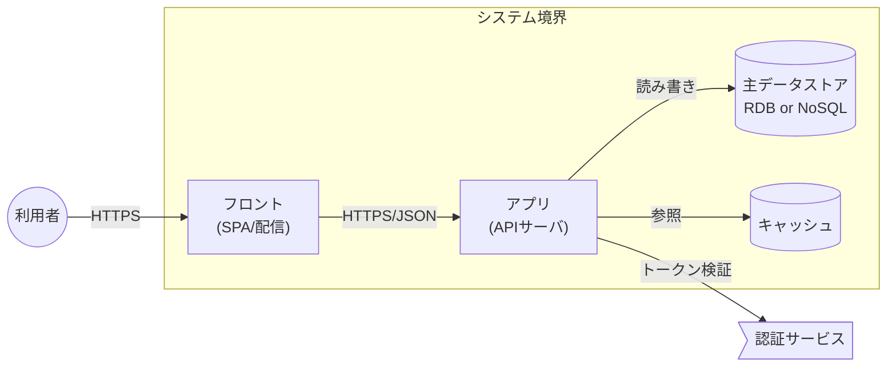

# システムアーキテクチャ 記載フォーマット（v0.1 たたき台）

**日付：** 2026-06-18
**記録者：** 羽床 ＋ Claude

> [補足] 機能に依らない**基盤（インフラ・利用サービス・設定値・開発/テスト/運用ツール・非機能の実現）**の設計を扱う。参考実物なし・第一原理。**このフォーマット自体は特定プラットフォームを規定しない**（スロットを用意し、採用技術はプロジェクトが埋める）。

---

## 位置づけ（整合性モデル）

- システムアーキテクチャは、機能の流れ（情報定義 → 機能仕様 → API仕様 → 実装）とは**別の「基盤・非機能」の軸**。要件（特に**非機能要件**）を、プラットフォーム・サービス・設定で**実現する土台**。
- **タイミング：機能仕様と並行して早めに決める**。情報定義の**物理層**（RDB/NoSQL の選択・キー設計）や API仕様の**整合性実装**（トランザクション・楽観ロックの手段）は、ここで選んだプラットフォームに依存するため、本書は**物理設計の前提**になる。
- 機能に依らない部分（インフラ・ツール・環境・非機能の実現）を扱い、機能仕様・情報定義の論理層とは分離する。

```
構想 → 要件 ┬─ 機能の流れ：情報定義 → 機能仕様 → API仕様 → 実装
            └─ 基盤の流れ：システムアーキテクチャ（非機能要件を実現）
                              ↘ 物理設計の前提を与える
→ 品質保証（機能・非機能の両方を検証）
```

## 全体構成（章立てテンプレート）

| 章 | 内容 |
|----|------|
| 1. 概要 | 目的・関連ドキュメント |
| 2. アーキテクチャ全体像 | 構成図・主要コンポーネント・データフロー |
| 3. プラットフォーム・利用サービス選定 | 実行基盤・サービス一覧・選定理由 |
| 4. 環境と設定値 | 環境一覧・環境別設定値・シークレット方針 |
| 5. 開発・テスト・運用ツール | CI/CD・IaC・テスト・監視/ログ |
| 6. 非機能要件の実現方針 | 可用性/性能/セキュリティ等 × 実現手段 |
| 7. アーキテクチャ意思決定記録（ADR） | 重要な選定の決定・背景・選択肢・トレードオフ |

> 以下、各章の書き方とコピペ用スケルトンを章番号に沿って示す。改訂履歴は持たず、要件トレーサビリティ文書で一元管理する。

---

## 1. 概要

目的＋関連ドキュメント宣言（要件〔非機能〕／情報定義の物理層／品質保証〔非機能観点〕）。「機能に依らない基盤の設計」であることを明記。

```markdown
## 1. 概要
- 本書は {システム名} の機能に依らない基盤（インフラ・サービス・設定・ツール・非機能の実現）を定義する。
- 関連ドキュメント：要件（非機能要件）／情報定義（物理層）／品質保証（非機能観点）
```

## 2. アーキテクチャ全体像

主要コンポーネントとデータフローを 1枚で俯瞰する。**ここで描くのは「プラットフォームに依らない汎用的なアーキテクチャ」**——コンポーネントは**役割（配信・API・永続化・認証・キャッシュ 等）で表し、特定の製品・サービス名は書かない**。具体的な製品・サービスへの割当ては **§3 と主要コンポーネント表（2-3）で行う**（情報定義の論理／物理分離と同じ思想：全体像＝論理、§3＝物理）。

記法は **Mermaid flowchart**（C4 の「コンテナ図」相当）を用いる。テキストで差分管理でき、GitHub/Zenn でそのまま描画され、AI でも生成しやすい。

### 2-1. 記法（凡例）

- **ノードの形＝種別**
  - `id["名称<br/>(種別)"]` 矩形 … アプリ／コンピュート／サービス
  - `id[("名称<br/>種別")]` シリンダ … データストア（RDB／NoSQL／キャッシュ）
  - `id>"名称"]` 旗 … 外部サービス（自前で運用しない）
  - `id(("名称"))` 円 … アクター（利用者・外部システム）
- **エッジ＝データフロー**：`A -->|"方式/データ"| B`（例 `|HTTPS/JSON|`・`|イベント|`）。向き＝呼び出し or データの流れ。
- **subgraph＝境界**：信頼境界・ネットワーク境界・環境を `subgraph` で囲う。
- 形・色の意味は**凡例として図の近くに併記**する。

### 2-2. 図（2階層で描く）

1. **システムコンテキスト**：自システムを1ノードに畳み、外部アクター・外部システムとの関係だけを描く。
2. **コンテナ図**：内部の主要コンポーネント（デプロイ単位）・データストア・外部サービスとデータフロー。

````markdown

````

### 2-3. 主要コンポーネント表（図と 1:1）

図の各ノードを表で補い、§3 の利用サービスと対応づける（図＝関係、表＝詳細）。

```markdown
| コンポーネント | 役割 | 採用技術/サービス（§3） | 種別 |
| -------------- | ---- | ----------------------- | ---- |
| フロント | UI配信 | {...} | 配信 |
| アプリ | API・業務ロジック | {...} | コンピュート |
| 主データストア | 永続化 | {RDB/NoSQL} | データストア |
```

## 3. プラットフォーム・利用サービス選定

実行基盤と利用サービスを**分類して**列挙し、**選定理由（対応する非機能要件）**を必ず添える。

```markdown
## 3. プラットフォーム・利用サービス選定
- プラットフォーム（実行基盤）：{...}
| 分類 | サービス/技術 | 用途 | 選定理由（対応 非機能要件） |
| ---- | ------------- | ---- | --------------------------- |
| コンピュート | {...} | {...} | {...} |
| データストア | {RDB / NoSQL ...} | {...} | {...} |
| 認証・認可 | {...} | {...} | {...} |
| ストレージ / CDN | {...} | {...} | {...} |
| メッセージング | {...} | {...} | {...} |
| 監視・ログ | {...} | {...} | {...} |
```

## 4. 環境と設定値

環境（dev/stg/prod 等）と**環境別の設定値**。シークレットは値を書かず管理方針を示す。

```markdown
## 4. 環境と設定値
- 環境：dev / stg / prod（用途・差分）
| 設定項目 | dev | stg | prod | 備考 |
| -------- | --- | --- | ---- | ---- |
| リージョン / スケール / タイムアウト / 上限 等 | | | | |
- シークレット：値は記載せず、保管先・ローテーション等の管理方針を示す
```

## 5. 開発・テスト・運用ツール

ビルド〜運用を支えるツール群。

```markdown
## 5. 開発・テスト・運用ツール
| 領域 | ツール/サービス | 用途 |
| ---- | --------------- | ---- |
| CI/CD | {...} | ビルド・デプロイ |
| IaC / 構成管理 | {...} | 環境の再現性 |
| テスト基盤 | {...} | 自動テスト実行 |
| 静的解析 / Lint | {...} | 品質ゲート |
| 監視・ログ・アラート | {...} | 可観測性 |
```

## 6. 非機能要件の実現方針

要件の**非機能種別タグ**（性能・セキュリティ・可用性・スケーラビリティ・コスト 等）ごとに、アーキテクチャで**どう実現するか**を 1:1 で書く。

```markdown
## 6. 非機能要件の実現方針
| 非機能（要件タグ） | 目標 / 基準 | 実現方針（アーキ） | 対応要件ID |
| ------------------ | ----------- | ------------------ | ---------- |
| 可用性 | {SLO 等} | 冗長化・多重化・フェイルオーバ | R-xxx |
| 性能 | {応答時間 等} | キャッシュ・水平スケール | R-xxx |
| セキュリティ | {基準} | 認証認可・暗号化・境界防御 | R-xxx |
| スケーラビリティ | {目標} | 自動スケール・分割 | R-xxx |
```

## 7. アーキテクチャ意思決定記録（ADR）

重要な選定は**決定記録**として残す（要件の決定コンテキストの基盤版）。

```markdown
### ADR-{番号} {決定タイトル}
- ステータス：採用 / 見送り / 保留
- 背景・状況：
- 選択肢：A / B / C（各トレードオフ）
- 決定：{採用案} ／ 理由：
- 影響：{物理設計・他フォーマットへの影響}
- 決定者 / 日付：
```

---

## 記載ルール（章横断の作法）

1. **機能に依らない「土台」だけを扱う**（機能仕様・情報定義の論理層とは分離）。さらに**全体像（§2）はプラットフォームに依らない汎用的なアーキテクチャ＝役割ベースで描き、製品・サービスへの割当ては §3 で行う**（アーキテクチャの論理／物理分離。図を変えずに採用技術だけ差し替えられる状態にする）。
2. **プラットフォーム・サービス選定は必ず選定理由（対応する非機能要件）を添える**。
3. **設定値は環境別に管理**。シークレットは値を書かず管理方針を示す。
4. **非機能要件の実現方針は、要件の非機能種別タグと 1:1 で対応づける**（対応要件IDを書く）。
5. **重要な選定は ADR**（決定・背景・選択肢・トレードオフ）で残す。
6. **構成図はコンポーネントとデータフローを示す**。
7. **このフォーマット自体は特定プラットフォームを規定しない** — スロットを用意し、採用技術はプロジェクトが埋める。
8. **改訂履歴は持たず、要件トレーサビリティ文書で一元管理する**。

## 貫通線（このフォーマット群との関係）

- **非機能の貫通線**：要件の非機能種別タグ → **システムアーキテクチャの実現方針（6章）** → 品質保証の非機能観点。（機能側の「値域・状態の貫通線」と対をなす、非機能側の縦串）
- **物理層への制約**：選定プラットフォーム → 情報定義の物理層（RDB/NoSQL 選択・キー設計）・API仕様の整合性実装（トランザクション・楽観ロックの手段）。本書が**物理設計の前提**を与える。
- **意思決定の追跡**：ADR が「なぜこの基盤か」を保持（要件の決定コンテキスト・トレーサビリティと連動）。

## コピペ用・空スケルトン（文書全体・最小セット）

```markdown
# {システム名}：システムアーキテクチャ

## 1. 概要
（機能に依らない基盤の設計／要件・情報定義物理層・品質保証への参照）

## 2. アーキテクチャ全体像
- 構成図：Mermaid flowchart（C4コンテナ図相当）。ノード形=種別／エッジ=データフロー／subgraph=境界。コンテキスト図＋コンテナ図の2階層
- 主要コンポーネント表：| コンポーネント | 役割 | 採用技術/サービス | 種別 |

## 3. プラットフォーム・利用サービス選定
- プラットフォーム：
| 分類 | サービス/技術 | 用途 | 選定理由（対応 非機能要件） |

## 4. 環境と設定値
| 設定項目 | dev | stg | prod | 備考 |
- シークレット管理方針：

## 5. 開発・テスト・運用ツール
| 領域 | ツール/サービス | 用途 |

## 6. 非機能要件の実現方針
| 非機能（要件タグ） | 目標/基準 | 実現方針 | 対応要件ID |

## 7. アーキテクチャ意思決定記録（ADR）
### ADR-{番号} {決定タイトル}
- ステータス / 背景 / 選択肢 / 決定・理由 / 影響 / 決定者・日付
```
