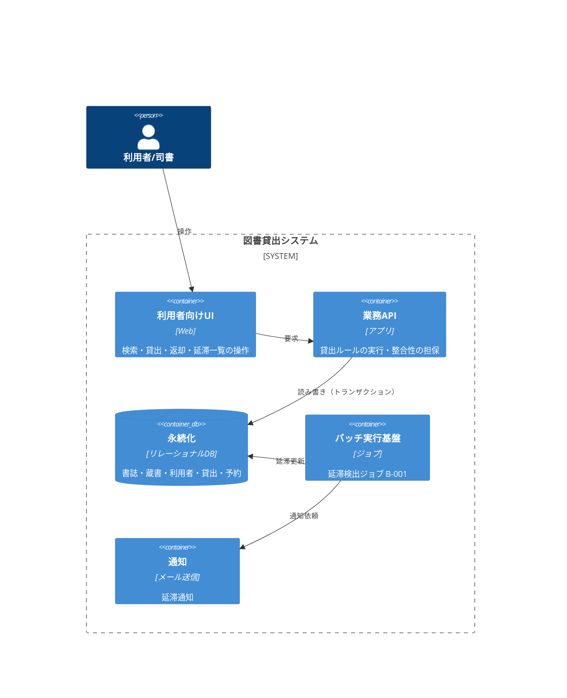

# システムアーキテクチャ — 図書貸出システム

> 本書は[アーキテクチャフォーマット](../formats/04-architecture.md)に沿った実インスタンス。
> 機能に依らない基盤・非機能の実現方針。**非機能の貫通線**（[要件](03-requirement.md) NFR → 本書 → [品質保証](08-quality-assurance.md)）を担う。

## 2. 全体像（論理・プラットフォーム非依存）

役割（ロール）で表す。特定製品には依存しない。

- **業務APIに貸出ルールを集約**：二重貸出防止・上限チェック・期限計算はAPI層で担保（UIには置かない）。
- **整合性の担保場所**＝永続化のトランザクション（[情報定義](05-info-def.md) §4 と対応）。

## 3. 物理配置（採用技術へのバインディング・例）

論理ロールを具体技術へ割り当てる層。本プロジェクトの初期採用は以下（差し替え可能）。

| 論理ロール | 物理（初期採用） | 設定の要点 |
| --- | --- | --- |
| 利用者向けUI | 一般的なWebサーバ | 館内LAN限定公開 |
| 業務API | アプリケーションサーバ | ステートレス・水平スケール可 |
| 永続化 | リレーショナルDB（強整合） | 貸出テーブルに一意制約（蔵書ID＋未返却） |
| バッチ実行基盤 | ジョブスケジューラ | 毎日6:00起動・冪等リラン可 |
| 通知 | メール送信サービス | 送信失敗はリトライ |

## 6. 非機能の実現方針

| NFR | 実現方針 |
| --- | --- |
| NFR-01 性能（照会1秒） | ISBN・蔵書状態にインデックス。検索は単一書誌引き。 |
| NFR-02 二重貸出防止 | 「蔵書ID＋未返却」を**一意制約**にし、同時貸出はDBで弾く（アプリの排他に依存しない）。 |
| NFR-03 可用性 | 平日日中稼働。バッチは早朝で利用時間帯と分離。 |

## 7. ADR（意思決定記録）

- **ADR-001：永続化に強整合のリレーショナルDBを採用**
  - 文脈：二重貸出の防止（NFR-02）に、同時実行下でも壊れない整合性が要る。
  - 決定：結果整合ではなく、一意制約＋トランザクションで担保できるRDBを採用。
  - 帰結：貸出は単一トランザクションで「状態確認→登録→状態更新」を原子的に行う。
