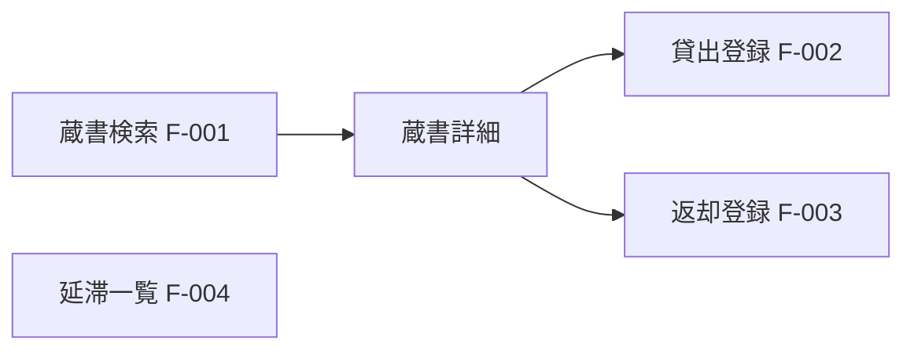
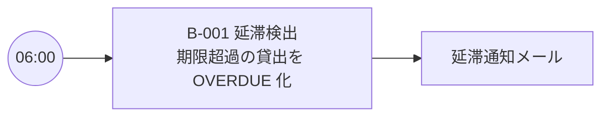
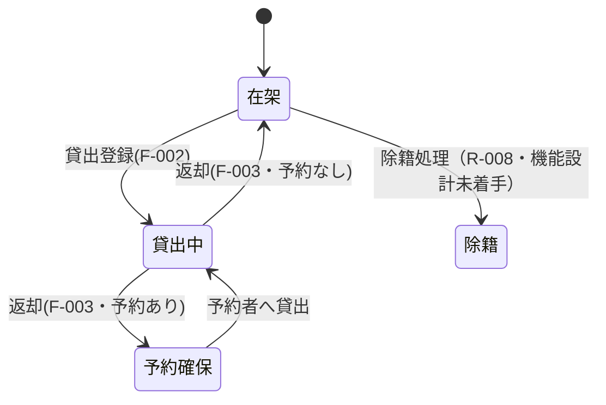

# 機能仕様 — 図書貸出システム

> 本書は[機能フォーマット](../formats/06-func-spec.md)に沿った実インスタンス。
> 機能ID（F-xxx）は[要件](03-requirement.md) R-xxx を受け、[API仕様](07-api-spec.md) API-xxx・[品質保証](08-quality-assurance.md) QA-xxx へ連鎖する。
> ※ 本書はサンプルにつき**簡略版**：画面一覧・共通コンポーネント・画面詳細・帳票・API一覧・権限マトリクス等の章（2・4・7〜11・13・14）は省略している。実プロジェクトではフォーマットどおり記載する。

## 1. 機能一覧

| 機能ID | 機能 | 対応要件 | 対応API |
| --- | --- | --- | --- |
| F-001 | 蔵書検索 | R-001 | API-001 |
| F-002 | 貸出登録（上限チェック含む） | R-002 / R-005 | API-002 |
| F-003 | 返却登録 | R-003 | API-003 |
| F-004 | 延滞一覧 | R-004 | API-004 |

## 3. 画面遷移図

## 4. 機能詳細

### F-001 蔵書検索
- 入力：ISBN（13桁・数字）またはタイトル語。**入力チェックは[用語集](02-glossary.md)の値仕様に従う**（ISBN＝13桁数字・チェックディジット）。
- 処理：ISBN一致で書誌1件、無ければタイトル部分一致。書誌配下の蔵書状態（在架/貸出中）を併せて返す。
- 出力：書誌＋蔵書状態一覧。該当なしは空。

### F-002 貸出登録（上限チェック含む）
- 前提：対象蔵書が `AVAILABLE`。
- ルール：
  1. 上限チェック（R-005）：利用者の未返却件数 ≥ 上限（一般5/学生10）なら拒否（理由＝現在冊数・上限）。
  2. 返却期限計算（R-002）：`dueOn = loanedOn + loanPeriodDays`。
  3. 登録：貸出INSERT＋蔵書状態を `ON_LOAN` へ（[情報定義](05-info-def.md) §4 の単一トランザクション）。
- 例外：貸出中の蔵書＝二重貸出エラー。

### F-003 返却登録
- 処理：貸出を `RETURNED`、`returnedOn=当日`。蔵書状態を `AVAILABLE`（予約待ちがあれば `HELD`）へ。
- 延滞：`returnedOn > dueOn` なら延滞日数を記録。

### F-004 延滞一覧
- 抽出：`returnedOn` 空 かつ `dueOn < 当日`。表示：利用者氏名・書名・延滞日数。

## 5. バッチ処理・ジョブフロー

| ジョブID | 名称 | スケジュール | 依存 | リラン |
| --- | --- | --- | --- | --- |
| B-001 | 延滞検出ジョブ | 毎日06:00 | なし | 冪等・再実行可 |

- B-001：`dueOn < 当日 かつ 未返却` の貸出状態を `OVERDUE` に更新し、通知対象を抽出（[アーキ](04-architecture.md) の通知ロールへ）。
- リラン/リカバリの全体規約は §15 実装標準に従う。

## 12. 状態遷移

**蔵書状態（CopyStatus）**

**貸出状態（LoanStatus）**：貸出中 →(返却) 返却済 ／ 貸出中 →(期限超過・B-001) 延滞 →(返却) 返却済。

## 15. 実装標準（横断的関心事）

| 関心事 | 標準 |
| --- | --- |
| 命名 | 標準名は[用語集](02-glossary.md)に従う（`loanedOn` 等）。 |
| バリデーション | 値域チェックは用語集の値仕様が唯一の基準。UIとAPIの二重防御。 |
| 日時 | 日付はISO8601・館のタイムゾーン基準。期限判定は日単位。 |
| トランザクション | 貸出/返却の状態更新は単一トランザクション（[情報定義](05-info-def.md) §4）。 |
| バッチ・ジョブ運用 | 全ジョブは冪等に設計しリラン可。失敗時は当日中に再実行、二重通知は抑止。 |
| エラー | 業務エラー（二重貸出・上限超過）は理由コードを返す。 |
